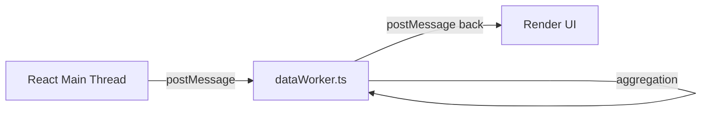

# Enterprise Executive BI Dashboard Documentation

This documentation describes the architecture, key features, access control model, and codebase organization of the **Enterprise Executive BI Dashboard**.

---

## 1. Executive Summary

The **Executive BI Dashboard** is a high-performance, bilingual (English/Arabic RTL) business intelligence application that translates raw B2B and B2C transaction ledgers into department-specific strategic insights. 

The dashboard is structured into **13 specialized command views** (CEO, B2B Sales, B2C Sales, HORECA Sales, Financial Planning, Supply Chain, Marketing, HR, Product Intelligence, Customer Profiles, Seller Profiles, Brand Performance, and System Admin Control).

---

## 2. Core Architecture & Modern Performance Patterns

To guarantee responsiveness and maintain portfolio-readiness for employers, the dashboard relies on several core engineering patterns:

### ⚡ Multithreaded Web Worker Data Pipeline
- All raw data processing, transaction filtering, search indexing, and aggregation metrics are offloaded to a background thread using native ES Web Workers ([src/workers/dataWorker.ts](src/workers/dataWorker.ts)).
- The main React thread only dispatches parameters and renders ready-to-display aggregations. This keeps the application running at 60 FPS even when handling complex, multi-period datasets.
- Handled with a robust worker wrapper that uses the Cache API and compressed JSON payloads.

### 📦 Dynamic Lazy Loading & Code Splitting
- To optimize initial bundle size, all 13 specialized dashboard views are code-split and lazy-loaded dynamically using a wrapper `lazyWithRetry()` helper.
- Prevents loading massive libraries like Recharts, Plotly, or Leaflet until they are needed by the active role perspective.

---

## 3. Codebase Organization & Component Refactoring

The codebase has been refactored from monolithic components into clean, maintainable, single-responsibility modules:

### 🔹 CEO Command View (`src/components/CeoView/`)
- [useCeoData.ts](src/components/CeoView/useCeoData.ts): Custom React hook that aggregates metrics, manages filtering states, and compiles sparkline historical ranges.
- [CeoKpiCards.tsx](src/components/CeoView/CeoKpiCards.tsx): Visualizes net revenue, margins, accounts, and return rates.
- [CeoCharts.tsx](src/components/CeoView/CeoCharts.tsx): Renders the timelinecomposed chart, segment share pie chart, and Plotly-based Sankey flow diagram.
- [OpportunityRadar.tsx](src/components/CeoView/OpportunityRadar.tsx): Visualizes AI Growth and cross-selling intelligence cards with confidence indicators.

### 🔹 Sales Director View (`src/components/SalesDirectorView/`)
- [useSalesDirectorData.ts](src/components/SalesDirectorView/useSalesDirectorData.ts): Contains state aggregation, filtering, and YoY comparison calculations.
- [SalesCharts.tsx](src/components/SalesDirectorView/SalesCharts.tsx): Timeline composed charts, segment share comparisons.
- [KpiCards.tsx](src/components/SalesDirectorView/KpiCards.tsx) & [MultiSelect.tsx](src/components/SalesDirectorView/MultiSelect.tsx): Reusable components for metrics and command filter options.

### 🔹 Brand Intelligence View (`src/components/BrandDashboardView/`)
- [useBrandDashboard.ts](src/components/BrandDashboardView/useBrandDashboard.ts): Manages active sales data calculations, sorting, and toggle states for brand sales.
- [BrandKpis.tsx](src/components/BrandDashboardView/BrandKpis.tsx) & [BrandCharts.tsx](src/components/BrandDashboardView/BrandCharts.tsx): Metric and timeline cards for Nova Koffee, Frappitt, Smoozy, and Zenith.
- [BrandChurnRisk.tsx](src/components/BrandDashboardView/BrandChurnRisk.tsx): Handles predictive churn risk algorithms, displaying at-risk customer lists with sorting and pagination.
- [BrandMarketing.tsx](src/components/BrandDashboardView/BrandMarketing.tsx): Outlines omnichannel pricing matrix tables and competitive brand directives.

### 🔹 Chatbot Assistant (`src/components/ChatbotAssistant/`)
- [intents.ts](src/components/ChatbotAssistant/intents.ts): Defines the offline intent-matching engine, NLP keywords, and local data aggregations.
- [useChatbot.ts](src/components/ChatbotAssistant/useChatbot.ts): Hook managing chat state, history lists, and typing delays.
- [ChatWindow.tsx](src/components/ChatbotAssistant/ChatWindow.tsx) & [exportUtils.ts](src/components/ChatbotAssistant/exportUtils.ts): Floating chat panels, messages, and PDF/CSV export utility handlers.

---

## 4. Dataset Architecture & Synthetic Data

Runs on synthetic data generated via @faker-js/faker, modeled on transaction patterns from real B2B/B2C retail operations. Location datasets ([src/data/locations_data.ts](src/data/locations_data.ts)) use synthetic corporate account names and regional governorate coordinates for demonstration.

---

## 5. Test Coverage & Verification

Unit test suites are configured under **Vitest**:
- [src/workers/dataWorker.test.ts](src/workers/dataWorker.test.ts): Tests the Web Worker pipeline. Includes check guards for Node environment context where browser worker globals like `self` are stubbed.
- Run tests locally using: `npm run test`
