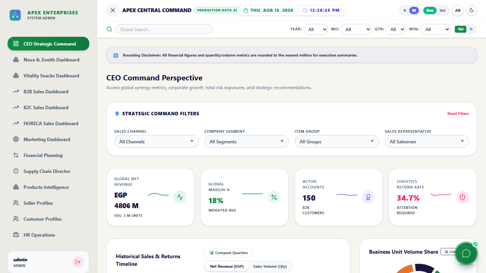
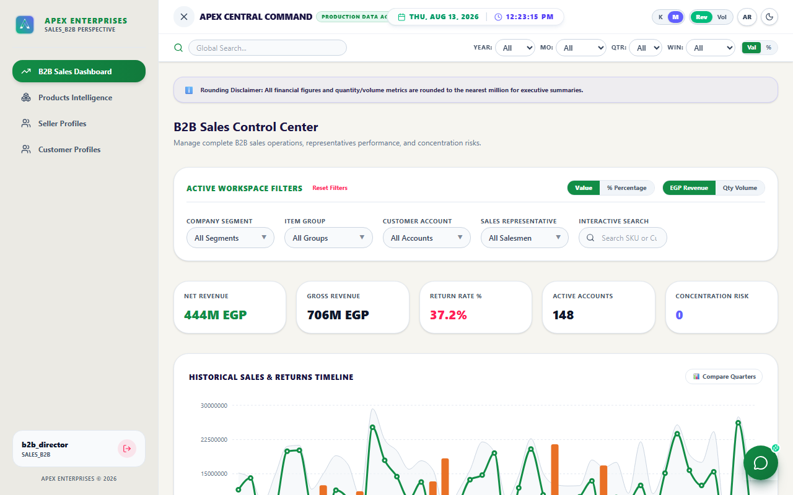
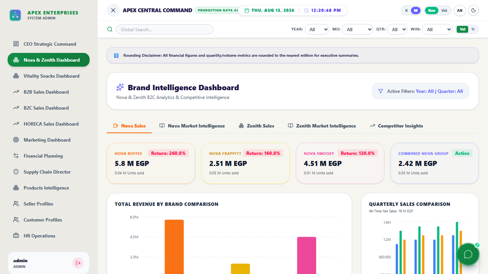
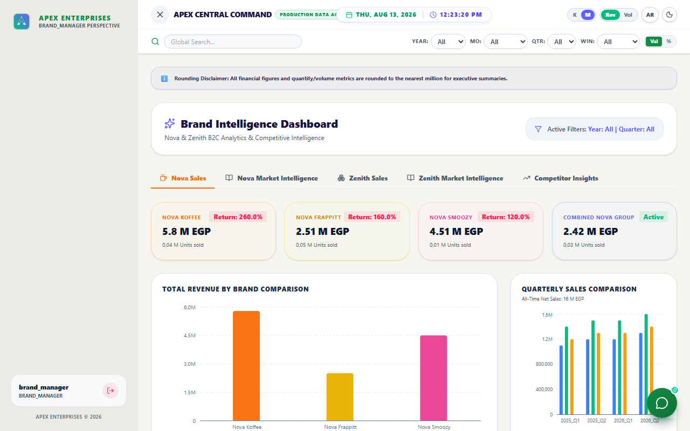

# Enterprise Executive BI Dashboard

[](https://github.com/Ahmed-Na7rawy/company-dashboard/actions/workflows/ci.yml)
[](https://company-dashboard-three.vercel.app/)

> **Live Portfolio Demo**: Experience the full interactive BI control center live on Vercel. Test role-based perspectives using the public evaluator credentials in the table below.

A high-performance, responsive, bilingual (English & Arabic RTL) executive analytics and control center for modern B2B & B2C enterprise operations.

Built with a **Multithreaded Web Worker Engine** that offloads heavy dataset filtering and metric aggregations to a background thread, maintaining a 60 FPS responsive UI during complex analytical operations.

---

## ⚡ Key Highlights & Architecture

- **Multithreaded Web Worker Engine**: Offloads transaction processing, search indexing, and multi-period calculations off the main thread. See full system design in [docs/architecture.md](docs/architecture.md).
- **Bilingual & RTL Native**: Instant full English and Arabic UI translation with right-to-left layout alignment.
- **13 Specialized Executive Views**: CEO Strategic View, B2B Sales, B2C Sales, HORECA, Financial Planning, Supply Chain & Inventory, Marketing Ads, HR Operations, Product Intelligence, Customer Profiles, Seller Profiles, Brand Performance, and System Admin Control.
- **Synthetic Data**: Runs on synthetic data generated via @faker-js/faker, modeled on transaction patterns from real B2B/B2C retail operations.
- **Executive Dark/Light Mode**: Sleek glassmorphic theme system with responsive mobile drawer navigation.

---

## 🖼️ Screenshots

| CEO Strategic Command | B2B Sales Director |
| :---: | :---: |
|  |  |

| Arabic RTL Native Layout | Brand Churn Risk Analytics |
| :---: | :---: |
|  |  |

---

## 🔑 Demonstration Login Credentials

> **Notice for Evaluators**: The credentials listed below are intentionally public demo credentials created specifically for portfolio evaluators to test role-specific UI routes. They represent a front-end client-side demonstration model and are not a real authentication/security pattern.

The application enforces **Role-Based Access Control (RBAC)**. Log in with any of the accounts below to test role-specific features:

| Role / Department | Username | Password | Access Scope & Perspective |
| :--- | :--- | :--- | :--- |
| **System Administrator** | `admin` | `admin123` | Full global system control, user target settings, unfiltered access. |
| **CEO / Executive** | `ceo` | `ceo123` | Strategic executive summary, high-level revenue KPIs, customer/seller profiles. |
| **Financial Director** | `finance` | `finance123` | Financial planning, margin calculators, revenue vs collection streams. |
| **B2B Sales Director** | `b2b_director` | `b2b123` | B2B sales pipelines, target comparisons, customer concentration risk. |
| **B2C Sales Director** | `b2c_director` | `b2c123` | B2C retail channels, product return analysis, channel performance. |
| **HORECA Sales Director** | `horeca_director` | `horeca123` | Hotel, restaurant, & catering sector sales & volume metrics. |
| **Supply Chain & Logistics** | `supply_chain` | `sc123` | Inventory turnover, SKU safety levels, and warehouse logistics tracking. |
| **Marketing & Advertising** | `marketing` | `mkt123` | Campaign ROAS, channel conversion, and customer acquisition metrics. |
| **HR & Operations** | `hr_director` | `hr123` | Department headcount, sales rep performance leaderboard, and operational alerts. |
| **Brand Manager** | `brand_manager` | `brand123` | Product brand dashboards and regional distribution mapping. |
| **Field Sales Representative** | `sales_rep` | `rep123` | Scoped view for assigned salesperson. |

> **Note:** This is a front-end-only demo. Authentication and role checks run entirely
> in the browser (credentials are defined in `App.tsx` and roles gate which components
> render) — there is no backend or server-enforced authorization. This is a deliberate
> simplification for a portfolio/demo deployment, not a production auth pattern.

---

## 🛠️ Tech Stack

- **Framework**: React 19 + TypeScript + Vite 6
- **Threading Engine**: Native ES Web Workers (`src/workers/dataWorker.ts`)
- **Visualizations**: Recharts + Plotly.js + Leaflet Maps
- **Styling**: Vanilla CSS + Tailwind CSS v4 + Glassmorphism Design System
- **Testing & E2E**: Vitest (Unit) + Playwright (E2E)
- **Icons**: Lucide React
- **Synthetic Data**: `@faker-js/faker`

---

## 🚀 Quick Start Guide

### Prerequisites
- [Node.js](https://nodejs.org/) (v20 or higher recommended)

### 1. Install Dependencies
```bash
npm install
```

### 2. Run Local Development Server
```bash
npm run dev
```
Open [http://localhost:5173/](http://localhost:5173/) in your browser.

### 3. Run Unit & E2E Test Suite
```bash
npm run test       # Run Vitest unit tests
npm run test:e2e   # Run Playwright E2E tests
```

### 4. Build for Production
```bash
npm run build
```
Generates an optimized static bundle in the `dist` directory.

---

## 📌 Known Limitations & Roadmap

### Current Limitations
1. **Synthetic Data Engine**: All financial records and transactions are generated via `@faker-js/faker` for offline demonstration.
2. **Client-Side Storage**: User preferences and custom notes persist in browser `localStorage` without a centralized remote database.
3. **Front-End Authorization**: RBAC routing is enforced client-side for presentation purposes rather than backend JWT/session verification.

### Future Roadmap
1. **Node.js/GraphQL Backend Integration**: Connect transaction processing to a distributed Postgres / TimescaleDB data warehouse.
2. **Real-time WebSockets Engine**: Stream live transaction updates directly to executive command dashboards.
3. **Advanced ML Predictive Pipeline**: Replace heuristic RFM scoring with server-side Python (scikit-learn) churn risk inference API.

---

## 📄 License

Distributed under the MIT License. See [LICENSE](LICENSE) for details.
